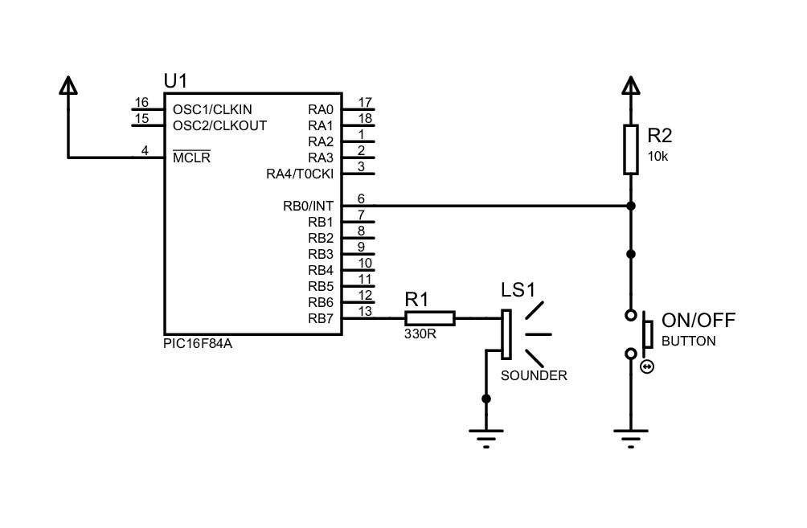

# Musicbox Project

This repository contains the source code for the Musicbox project. The Musicbox is a project created as part of an educational control work. 

## Tools Used

- MPLAB X IDE: The MPLAB X Integrated Development Environment (IDE) provides a user-friendly interface for writing, compiling, and debugging the firmware code for the Musicbox project. It offers a range of useful features to facilitate development.

- XC8 Compiler: The XC8 compiler is a highly efficient C compiler designed specifically for Microchip PIC microcontrollers. It translates the firmware code written in the C programming language into machine code that can be executed on the PIC16F84A microcontroller.

## How to run

The _assets/ folder contains the firmware and the project for the Proteus Design Suite.

## Scheme

